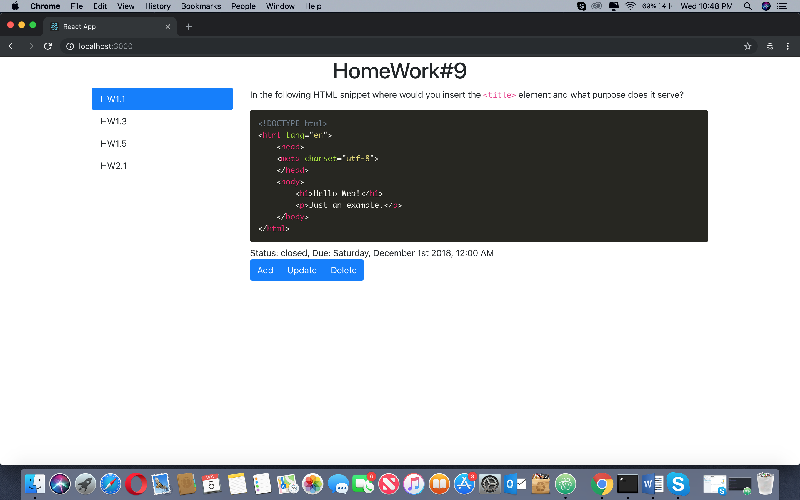
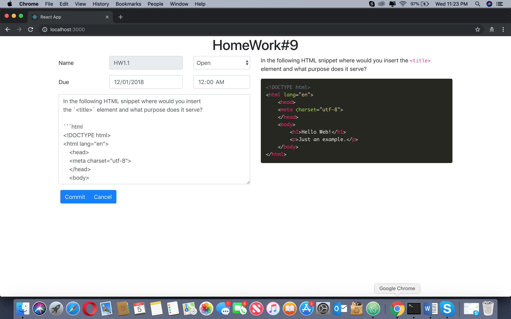
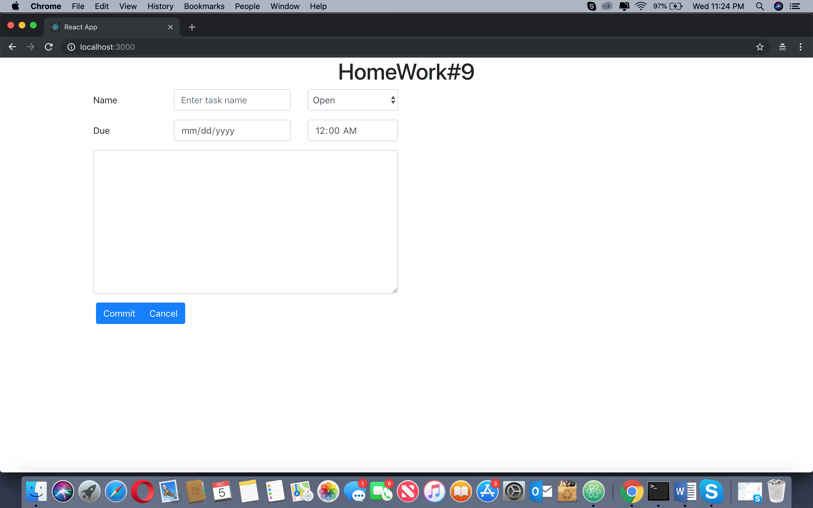
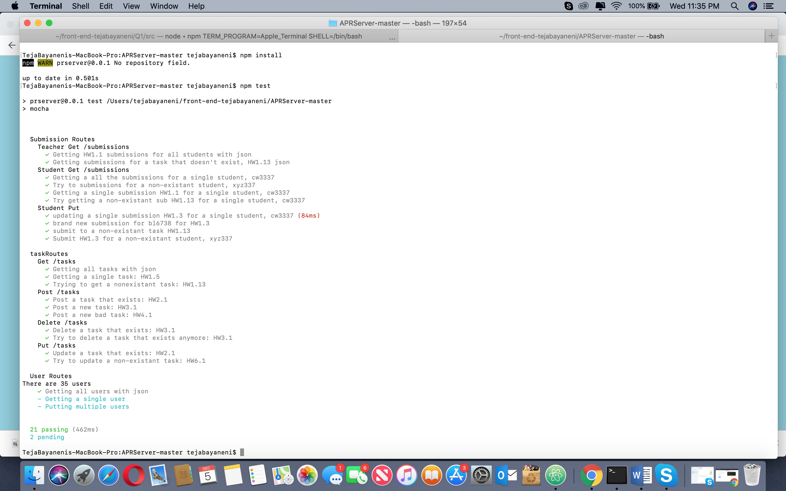
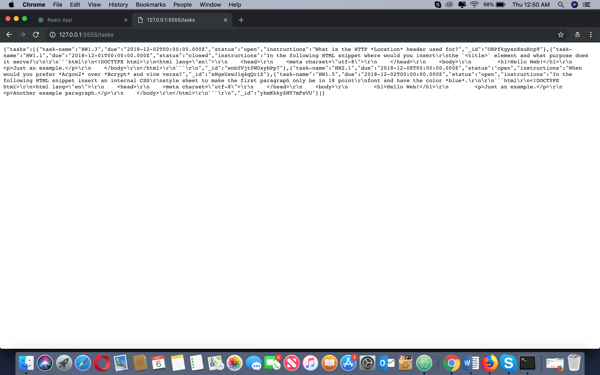
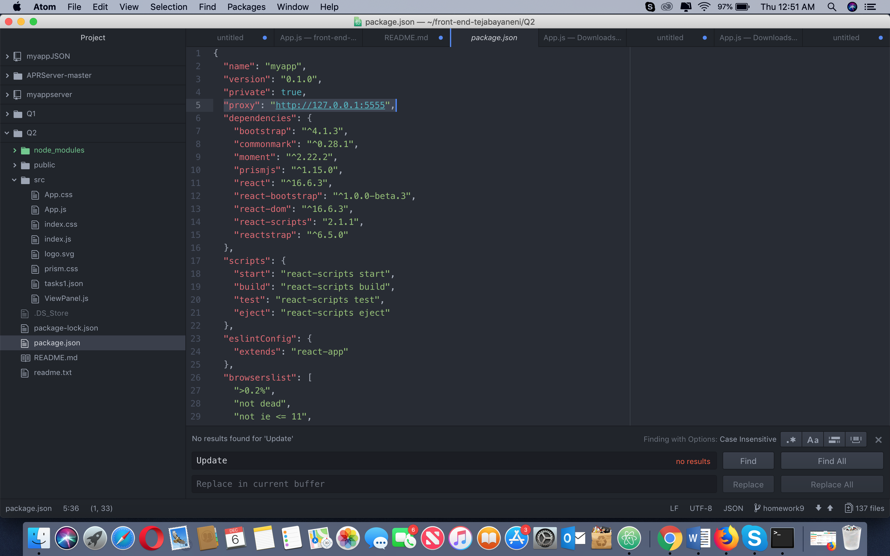

# Homework 9 CS651

**Krishna Teja Bayaneni**

**Net Id: NV4956**

## Question 1

**a)**
```javascript
let that=this;

let taskList = that.state.tasks.map(function(item,i){  
  return(
    <NavItem key={i}><NavLink className={classnames({ active: that.state.activeTab === i })} onClick={() => { that.toggle(i); }}>
      {item["task-name"]}</NavLink></NavItem>
  );
})
return(
    <Container>
{ taskList && taskList.length > 0 &&
  <Row>
    <Col sm="3"><Nav vertical pills>{taskList}</Nav></Col>
  </Row>
}
</Container>
);
}
```


**b)**
```javascript
let that=this;
let parser = new Parser()
let renderer = new HtmlRenderer()
let currentIns = renderer.render(parser.parse(that.state.instructions));//add form
let taskDetails = that.state.tasks.map(function(item,i){
  let ins = renderer.render(parser.parse(item.instructions));//displaying page
  <div dangerouslySetInnerHTML={{__html: ins}}></div>
})
  <FormGroup row>
    <Col sm={12}>
      <Input rows={10} value={this.state.instructions} onChange={this.handleChange} type="textarea" name="instructions" id="instructions" required />
    </Col>
  </FormGroup>
  { taskList && taskList.length > 0 &&
    <Row>
      <Col sm="3"><Nav vertical pills>{taskList}</Nav></Col>
      <Col sm="9">{taskDetails}</Col>
    </Row>
  }
```


**c)**

*Initially we get the instructions from the json file and set the json data in to the tasks variable in the setState function. When the user clicks on the taskName corresponding  instructions will be displayed based on the index value*


**d)**
```javascript
handleDelete(data) {
  this.setState({
    error: '',
    success:false
  });

  let tasks = this.state.tasks.filter((task) => {
    return data["task-name"] !== task["task-name"];
  });

  this.setState(state => {
      state.tasks = tasks;
      state.deleteSuccess= true;
      state.activeTab = 0;
      return state;
  });
}
```
**e)**
*I am calling the showEditForm function on clicking the update button. It is binding the task name and in the setState updating the values to the new values and after giving commit the values are been saved and displayed.*

**f)**
*I am calling the showAddForm function on clicking the add button. It is same as the update form but i am not saving any of the task index or name and just adding the values set in the "Form" using the setState and after giving commit the values are been displayed and new task has been added*

## Question 2
**a)**



**b)**

*Added "proxy": "http://127.0.0.1:5555",*

**c)**
*Invoked fetch from the function "componentDidMount()" and the fetch returns the task data in the form of promises*


**d)**
```javascript

if(this.state.editMode){
  method = 'PUT';
  url = '/tasks/'+this.state.taskName;
}

this.setState({ error: '', success:false });  
fetch(url, {
    method: method,
    headers: {'Content-Type':'application/json'},
    body: JSON.stringify({
      'task-name': this.state.taskName,
      'due': this.state.dueDate+'T'+this.state.dueTime+':00.000Z',
      'status': this.state.status,
      'instructions': this.state.instructions,
    })
})
.then(res => res.json())
.then(json => {
  if(json.error !== undefined && json.error !== ''){
    this.setState({ error: json.error });  
  }
  else if(json._id !== undefined && json._id !== ''){
    let elements = this.state.tasks.slice();
    if(!this.state.editMode){
      elements.push({
        'task-name': this.state.taskName,
        'due': this.state.dueDate+'T'+this.state.dueTime+':00.000Z',
        'status': this.state.status,
        'instructions': this.state.instructions
      });
    }else{
      const nextState = this.state.tasks.map((task,index) => {
        if(this.state.taskName === task["task-name"]){
          return {
            ...task,
            "task-name": this.state.taskName,
            due: this.state.dueDate+'T'+this.state.dueTime+':00.000Z',
            status: this.state.status,
            instructions: this.state.instructions
          }
        }
        return task;
      });
      elements = nextState;
    }  
    this.setState({ success: true, addForm:false, tasks:elements });
  }
  else{
    this.setState({ error: 'Request Error!' });  
  }
}, error =>{
  console.log('err',error);
  this.setState({ error: 'Network error!' });
});
}
```
*When i click on the update button it is navigating to the form by calling "openEditModal()"function and i am binding it with the task information so the form will contain the existing task information and when i click on the commit button the handleSubmit will be called and the PUT method will be invoked for the API URL"/tasks/taskName" and the  modified data will be convert as JSON format and it is send as a request to the server by the fetch function and the server will send a response with success or failure and the response is converted as a JSON and is updated in setState.*


**e)**

```javascript
handleSubmit(event) {
  event.preventDefault();  

  let method = 'POST';
  let url = '/tasks/';
  if(this.state.editMode){
    method = 'PUT';
    url = '/tasks/'+this.state.taskName;
  }

  this.setState({ error: '', success:false });  
  fetch(url, {
      method: method,
      headers: {'Content-Type':'application/json'},
      body: JSON.stringify({
        'task-name': this.state.taskName,
        'due': this.state.dueDate+'T'+this.state.dueTime+':00.000Z',
        'status': this.state.status,
        'instructions': this.state.instructions,
      })
  })
  .then(res => res.json())
  .then(json => {
    if(json.error !== undefined && json.error !== ''){
      this.setState({ error: json.error });  
    }
    else if(json._id !== undefined && json._id !== ''){
      let elements = this.state.tasks.slice();
      if(!this.state.editMode){
        elements.push({
          'task-name': this.state.taskName,
          'due': this.state.dueDate+'T'+this.state.dueTime+':00.000Z',
          'status': this.state.status,
          'instructions': this.state.instructions
        });
      }else{
        const nextState = this.state.tasks.map((task,index) => {
          if(this.state.taskName === task["task-name"]){
            return {
              ...task,
              "task-name": this.state.taskName,
              due: this.state.dueDate+'T'+this.state.dueTime+':00.000Z',
              status: this.state.status,
              instructions: this.state.instructions
            }
          }
          return task;
        });
        elements = nextState;
      }  
      this.setState({ success: true, addForm:false, tasks:elements });
    }
    else{
      this.setState({ error: 'Request Error!' });  
    }
  }, error =>{
    console.log('err',error);
    this.setState({ error: 'Network error!' });
  });
}
```
*When i click on the add button it is navigating to the form by calling the "showAddForm()" function and a form is displayed which should contain the task information  and when i click on the commit button the handleSubmit will be called and the POST method will be invoked for the API URL"/tasks" and the  newly added data will be convert as JSON format and it is send as a request to the server by the fetch function and the server will send a response with success or failure and the response is converted as a JSON format and is added in the setState function. After the new task has been added it will automatically updated in the GUI*


**f)**
```javascript
handleDelete(data) {
  this.setState({ error: '', success:false });  
  fetch('/tasks/'+data["task-name"], {
    method: 'DELETE',
    headers: {'Content-Type':'application/json'}
  })
  .then(res => res.json())
  .then(json => {
    if(json.success){
      let tasks = this.state.tasks.filter((task) => {
        return data["task-name"] !== task["task-name"];
      });
      this.setState(state => {
        state.tasks = tasks;
        state.deleteSuccess= true;
        state.activeTab = 0;
        return state;
      });
    }
    else{
      this.setState({ deleteError: 'Request Error!' });  
    }
  }, error =>{
    console.log('err',error);
    this.setState({ deleteError: 'Network error!' });
  });
}
```
*When i click on the delete i am invoking a function handleDelete(). The fetch will be invoked for the API URL "/tasks/taskName" with delete method and server will respond and the data will converted as JSON and the particular data will be deleted in the setState*
